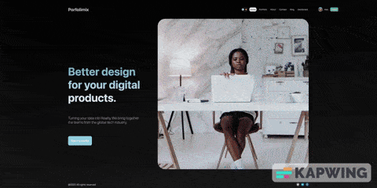

# Portfolimix

Welcome to Portfolimix, a portfolio website template for presenting a business or various digital services. Ideal for businesses such as: Website Development,Design, Arts and any other presentation. It has several sections for complete and detailed information about the services provided and a product catalog.

## Sections

- **Home**: Basic home page, with a brief description of the service, the face of the website

- **Portfolio**: Examples of work/examples of services provided, or product catalog

- **About Us**: Complete information about the business/service

- **Contact**: Submitting a form to contact us

- **Blog**: A separate block with relevant articles or useful information.

- **Dashboard**: Login to your personal account/ create a personal account for access to editing the dashboard and adding blogs.

[Open Demo](https://fullstack-next-js-lake.vercel.app)



## Getting Started

First, run the development server:

```bash
npm run dev
# or
yarn dev
# or
pnpm dev
# or
bun dev
```

Open [http://localhost:3000](http://localhost:3000) with your browser to see the result.
